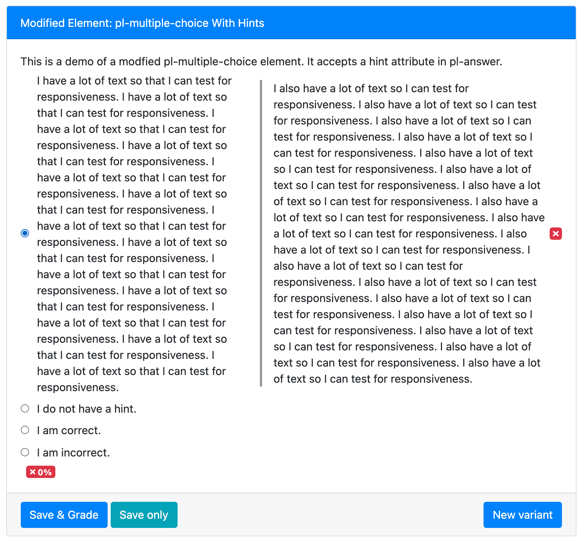
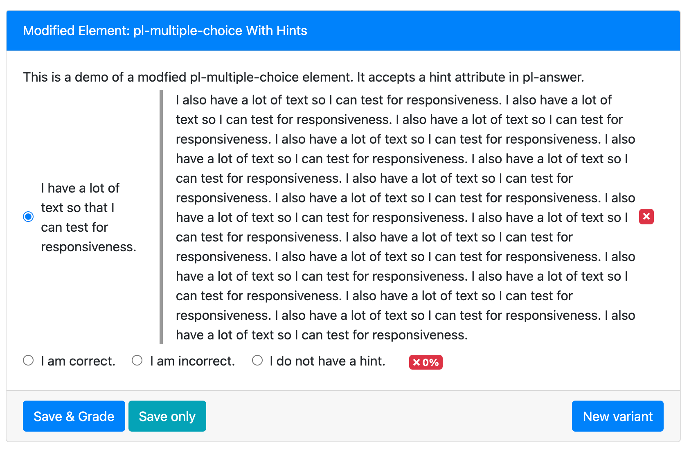

# pl-multiple-choice Element With Hints

Modified `pl-multiple-choice` element that accepts a `hint` attribute in `pl-answer`. When a formative-type question is graded, an inline hint is shown to the student.

# Examples

## Non-inline Example



## Inline Example



# Example Usage

```html
<pl-multiple-choice hide-letter-keys="true" answers-name="example">
    <pl-answer hint="No.">I am incorrect.</pl-answer>
    <pl-answer hint="Correct!" correct=true>I am correct.</pl-answer>
    <pl-answer>I do not have a hint.</pl-answer>
</pl-multiple-choice>
```

Contact cris.moran7524@gmail.com or find Cristian Moran on Slack for questions